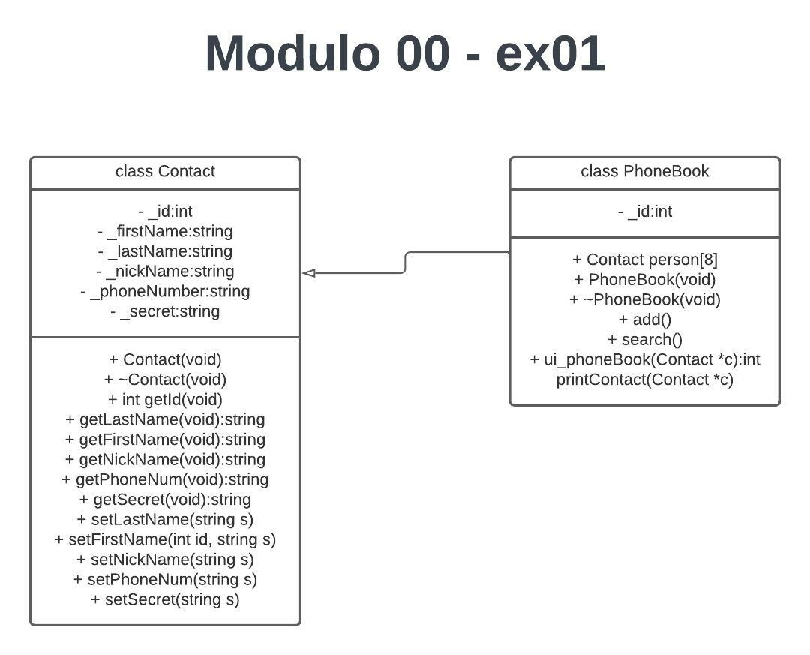

<h1 align="center">
	🧰 00_module
</h1>

## 💡 About the project

	🚀 TLDR: Namespaces, classes, member functions, stdio streams, initialization lists, static, const, and some other basic
    stuff.

## Key points:

* Imperative programming.
* Object-oriented programming.
* Rigor.
* OOP.

## Skills:

* Imperative programming.
* Rigor.
* Object-oriented programming.

## List of Exercises:

* [`exercise 00`](/00_module/ex00)		- Megaphone.
* [`exercise 01`](/ex01)        - My Awesome PhoneBook.
* [`exercise 02`](/ex02)        - The Job Of Your Dreams.

### UML Diagram

**1. MegaPhone**

